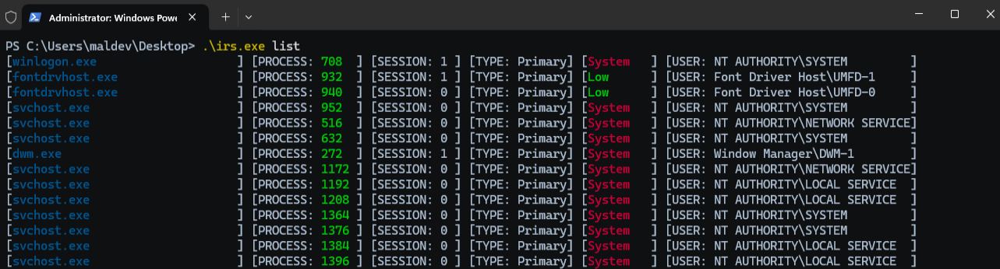
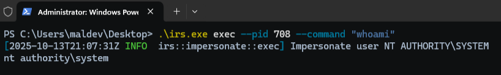
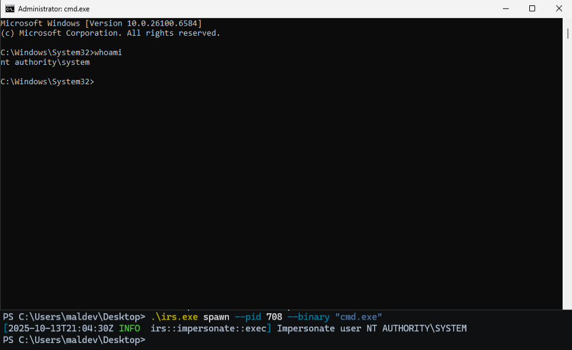
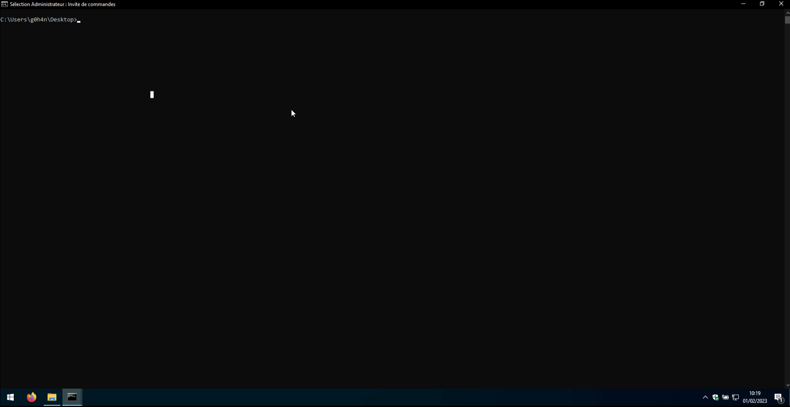

# IRS (Impersonate-RS)

> 💡 IRS is a library version of [https://github.com/zblurx/impersonate-rs](https://github.com/zblurx/impersonate-rs), [zblurx](https://twitter.com/_zblurx)

Reimplementation of [Defte](https://twitter.com/Defte_) [Impersonate](https://github.com/sensepost/impersonate) in plain Rust. For more informations about it, see this [blogpost](https://sensepost.com/blog/2022/abusing-windows-tokens-to-compromise-active-directory-without-touching-lsass/).

The token impersonation approach is a bit different from Defte Impersonate : here you have to select a PID where you want to impersonate the Primary Token, then `irs.exe` will:
1. Duplicate the token
2. Spawn a named pipe (to get exec output)
3. Execute the command with the targeted token through `CreateProcessWithTokenW` and output the result to the named pipe
4. Collect the command output from the named pipe
5. Print the command output

This approach will allow you to impersonate any user on the target computer as long as you have administrator privileges (No NT SYSTEM needed) and is usable with and without GUI.

## Summary

- [Build](#build)
- [Usage](#usage)
    - [List process to impersonate](#list)
    - [Exec command](#exec)
    - [Spawn process](#spawn)
    - [Library example](#library)
- [Demo](#demo)

## Build

```bash
# Build it from docker
git clone https://github.com/zblurx/impersonate-rs
cd impersonate-rs
make release

# Or from cargo in your host
make windows

# or
# 32 bits
RUSTFLAGS="--remap-path-prefix $$HOME=~" cargo build --release --target i686-pc-windows-gnu
# 64 bits
RUSTFLAGS="--remap-path-prefix $$HOME=~" cargo build --release --target x86_64-pc-windows-gnu

# Build documentation
cargo doc --open --no-deps

# More information
make help
```

## Usage

Like a static binary :

```bash
PS C:\Users\maldev\Desktop> .irs.exe --help
IRS (Impersonate-RS) It's a windows token impersonation tool written in Rust. zblurx <https://twitter.com/_zblurx>

Usage: irs.exe <COMMAND>

Commands:
  list   List all process PID available to impersonate Tokens
  exec   Execute command line from impersonate PID and get output
  spawn  Spawn new process from impersonate PID
  help   Print this message or the help of the given subcommand(s)

Options:
  -h, --help  Print help
```

### `list`

The `list` command list processes, with their session id, token type and associated user.

```bash
PS C:\Users\maldev\Desktop> .\irs.exe list 

[winlogon.exe                    ] [PROCESS: 624  ] [SESSION: 1 ] [TYPE: Primary] [System] [USER: AUTORITE NT\Système         ]
[lsass.exe                       ] [PROCESS: 672  ] [SESSION: 0 ] [TYPE: Primary] [System] [USER: AUTORITE NT\Système         ]
[svchost.exe                     ] [PROCESS: 780  ] [SESSION: 0 ] [TYPE: Primary] [System] [USER: AUTORITE NT\Système         ]
[fontdrvhost.exe                 ] [PROCESS: 788  ] [SESSION: 0 ] [TYPE: Primary] [Low   ] [USER: Font Driver Host\UMFD-0     ]
[fontdrvhost.exe                 ] [PROCESS: 796  ] [SESSION: 1 ] [TYPE: Primary] [Low   ] [USER: Font Driver Host\UMFD-1     ]
[svchost.exe                     ] [PROCESS: 888  ] [SESSION: 0 ] [TYPE: Primary] [System] [USER: AUTORITE NT\SERVICE RÉSEAU  ]
[svchost.exe                     ] [PROCESS: 948  ] [SESSION: 0 ] [TYPE: Primary] [System] [USER: AUTORITE NT\Système         ]
[dwm.exe                         ] [PROCESS: 412  ] [SESSION: 1 ] [TYPE: Primary] [System] [USER: Window Manager\DWM-1        ]
[svchost.exe                     ] [PROCESS: 460  ] [SESSION: 0 ] [TYPE: Primary] [System] [USER: AUTORITE NT\Système         ]
[svchost.exe                     ] [PROCESS: 696  ] [SESSION: 0 ] [TYPE: Primary] [System] [USER: AUTORITE NT\SERVICE LOCAL   ]
[REDACTED]
[svchost.exe                     ] [PROCESS: 836  ] [SESSION: 0 ] [TYPE: Primary] [System] [USER: AUTORITE NT\SERVICE LOCAL   ]
[svchost.exe                     ] [PROCESS: 908  ] [SESSION: 0 ] [TYPE: Primary] [System] [USER: AUTORITE NT\SERVICE LOCAL   ]
[svchost.exe                     ] [PROCESS: 1060 ] [SESSION: 0 ] [TYPE: Primary] [System] [USER: AUTORITE NT\SERVICE LOCAL   ]
[svchost.exe                     ] [PROCESS: 1088 ] [SESSION: 0 ] [TYPE: Primary] [System] [USER: AUTORITE NT\SERVICE LOCAL   ]
[svchost.exe                     ] [PROCESS: 1124 ] [SESSION: 0 ] [TYPE: Primary] [System] [USER: AUTORITE NT\Système         ]
[svchost.exe                     ] [PROCESS: 1176 ] [SESSION: 0 ] [TYPE: Primary] [System] [USER: AUTORITE NT\Système         ]
```




### `exec`

The `exec` command open the target process id in the `pid` argument, duplicate its token and execute a command with the new token.

```bash
X:\>whoami
adcs1\administrator

PS C:\Users\maldev\Desktop> .\irs.exe exec --pid 708 --command whoami
[2025-10-13T20:59:42Z INFO  irs::impersonate::exec] Impersonate user NT AUTHORITY\SYSTEM
nt authority\system

PS C:\Users\maldev\Desktop> .\irs.exe exec --pid 708 --command "whoami /all"
[2025-10-13T20:59:42Z INFO  irs::impersonate::exec] Impersonate user NT AUTHORITY\SYSTEM

USER INFORMATION
----------------

User Name           SID
=================== ========
nt authority\system S-1-5-18


GROUP INFORMATION
-----------------

Group Name                             Type             SID          Attributes
====================================== ================ ============ ==================================================
BUILTIN\Administrators                 Alias            S-1-5-32-544 Enabled by default, Enabled group, Group owner
Everyone                               Well-known group S-1-1-0      Mandatory group, Enabled by default, Enabled group
NT AUTHORITY\Authenticated Users       Well-known group S-1-5-11     Mandatory group, Enabled by default, Enabled group
Mandatory Label\System Mandatory Level Label            S-1-16-16384


PRIVILEGES INFORMATION
----------------------

Privilege Name                  Description                                   State
=============================== ============================================= ========
SeAssignPrimaryTokenPrivilege   Replace a process level token                 Disabled
SeIncreaseQuotaPrivilege        Adjust memory quotas for a process            Disabled
SeTcbPrivilege                  Act as part of the operating system           Enabled
SeSecurityPrivilege             Manage auditing and security log              Disabled
SeTakeOwnershipPrivilege        Take ownership of files or other objects      Disabled
SeLoadDriverPrivilege           Load and unload device drivers                Disabled
SeProfileSingleProcessPrivilege Profile single process                        Enabled
SeIncreaseBasePriorityPrivilege Increase scheduling priority                  Enabled
SeCreatePermanentPrivilege      Create permanent shared objects               Enabled
SeBackupPrivilege               Back up files and directories                 Disabled
SeRestorePrivilege              Restore files and directories                 Disabled
SeShutdownPrivilege             Shut down the system                          Disabled
SeDebugPrivilege                Debug programs                                Enabled
SeAuditPrivilege                Generate security audits                      Enabled
SeSystemEnvironmentPrivilege    Modify firmware environment values            Disabled
SeChangeNotifyPrivilege         Bypass traverse checking                      Enabled
SeUndockPrivilege               Remove computer from docking station          Disabled
SeManageVolumePrivilege         Perform volume maintenance tasks              Disabled
SeImpersonatePrivilege          Impersonate a client after authentication     Enabled
SeCreateGlobalPrivilege         Create global objects                         Enabled
SeTrustedCredManAccessPrivilege Access Credential Manager as a trusted caller Disabled
```



### `spawn`

The `spawn` command duplicates the token of the selected `pid` and launches a new process using that duplicated token.

```bash
PS C:\Users\maldev\Desktop> .\irs.exe exec --pid 708 --binary "C:\Windows\System32\cmd.exe"
[2025-10-13T20:59:42Z INFO  irs::impersonate::exec] Impersonate user NT AUTHORITY\SYSTEM
```



### `library`

Or directly on your **Rust** project like:

```Cargo.toml```:

```bash
[dependencies]
irs = { path = "/data/02-GIT/github/impersonate-rs/", version = "0.2.1" }
```

Or with github repo:

```bash
[dependencies]
irs = { git = "https://github.com/g0h4n/impersonate-rs", version = "0.2.1" }
```

```main.rs```:

```rust
use irs::utils::*;

fn main() {
    impersonate::se_priv_enable().expect("[!] Failed to run se_priv_enable()");
    token::enum_token().expect("[!] Failed to run enum_token()");
}
```

To see all the available functions use the following command to open the **Rust documentation**.

```bash
cargo doc --open --no-deps
```

## Demo



## Contributors

Many thanks to [g0h4n](https://twitter.com/g0h4n_0) for his contribution to the repo (made it a library, added color, clean up the code, ect.)